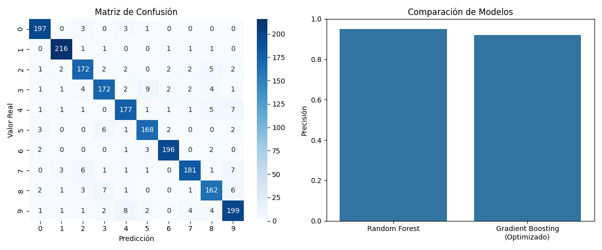

# Predicción de Imágenes 

Este proyecto implementa un clasificador de imágenes usando técnicas de Machine Learning con una interfaz web para que los usuarios puedan subir sus propias imágenes y obtener predicciones en tiempo real.

## Tecnologías utilizadas

- **Python**
- **scikit-learn** para los modelos de machine learning
- **Flask** para la aplicación web
- **Pandas y NumPy** para manipulación de datos
- **Matplotlib y Seaborn** para visualizaciones

## Características

- Interfaz web sencilla para subir imágenes
- Clasificación de imágenes en tiempo real
- Visualización de resultados con porcentaje de confianza
- Modelo mejorado con técnicas avanzadas

## Resultados del entrenamiento

Los modelos fueron entrenados y evaluados para asegurar un buen rendimiento en la clasificación de imágenes:

La imagen muestra:
- Una matriz de confusión mostrando el rendimiento por clase
- Comparación entre el modelo base (Random Forest) y el modelo avanzado (Gradient Boosting optimizado)